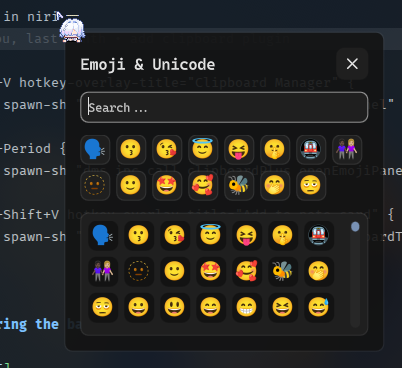

# ClipBoard+

Advanced clipboard manager for DMS with clipboard history, pinned items, notes, built-in ToDo list, and emoji picker.

Ported / inspired from [clipper in noctalia-shell](https://noctalia.dev/plugins/clipper/) by [blackbartblues](https://github.com/blackbartblues).

## Attribution

- Original design and concept by [blackbartblues](https://github.com/blackbartblues).
- Code for the Emoji picker feature is taken from [dms-emoji-launcher](https://github.com/devnullvoid/dms-emoji-launcher) by [devnullvoid](https://github.com/devnullvoid).

## Features

- Clipboard
- Clipboard categorization
- ToDo
- Pinned clipboard
- Notes
- Emoji picker
- Keyboard navigation

## Notes

- Uses `cliphist`, `wl-copy`, and `wl-paste`. Requires `cliphist` and `wl-clipboard` to be installed.
- Default config / state data stored under `~/.config/dms-clipboardPlus`.

## Usage Notes

Because this is a widget plugin. You will need to at this plugin into the widget bar for it to work with the ipc. But, don't worry about this because i have made a setting to hide the plugin completely from the bar which you can enable if you dont want it on your bar.

## IPC Usage

```bash
# Open/close/toggle panel
dms ipc call clipboardPlus openPanel
dms ipc call clipboardPlus closePanel
dms ipc call clipboardPlus togglePanel

# Emoji picker
dms ipc call clipboardPlus openEmojiPanel

# Note cards
dms ipc call clipboardPlus addNoteCard "Quick note"
dms ipc call clipboardPlus listNoteCards
dms ipc call clipboardPlus exportNoteCard "note_id"

# Add current clipboard data to ToDo
dms ipc call clipboardPlus addClipboardToTodo

# Add current clipboard data to note card
dms ipc call clipboardPlus addClipboardToNoteCard
```

Example in niri

```kdl
    Mod+V hotkey-overlay-title="Clipboard Manager" {
        spawn-sh "dms ipc call clipboardPlus togglePanel"
    }
    Mod+Period { 
        spawn-sh "dms ipc call clipboardPlus openEmojiPanel"; 
    }
    Mod+Shift+V hotkey-overlay-title="Add to note card" {
        spawn-sh "dms ipc call clipboardPlus addClipboardToNoteCard"
    }
```

## Blurring the background

> [!NOTE]
> I don't really know how to "really" change the background opacity. Maybe i will take a look at it again but if you know feel free to make PR.

Example in niri

```bash
layer-rule {
    match namespace="^dms-clipboardPlus-panel"

    background-effect {
        blur true
        xray false
    }
}
```

## Known Bugs

Sending close / toggle command from IPC wont close ClipBoard+ that is opened from widget / bar.

## Preview





