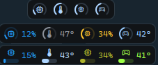
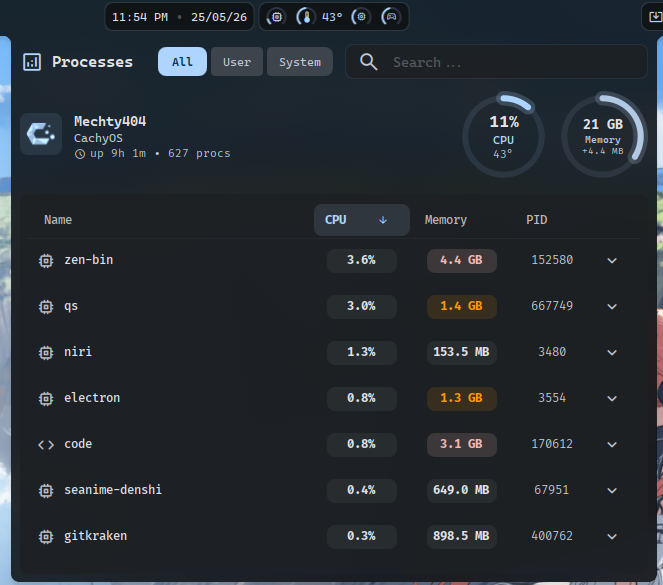
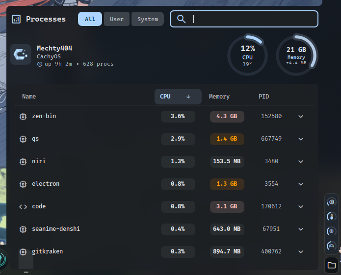
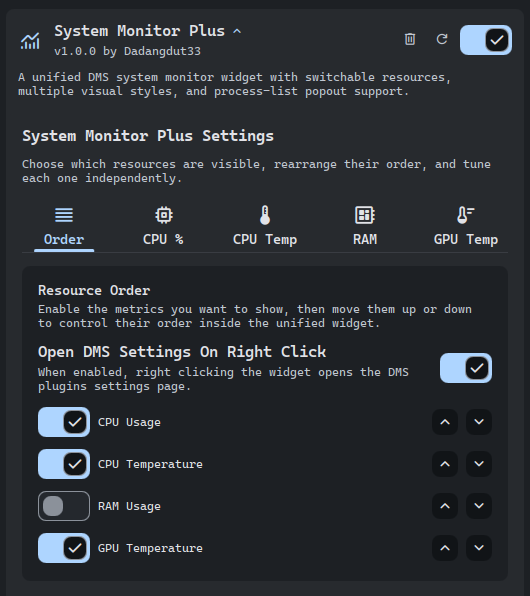
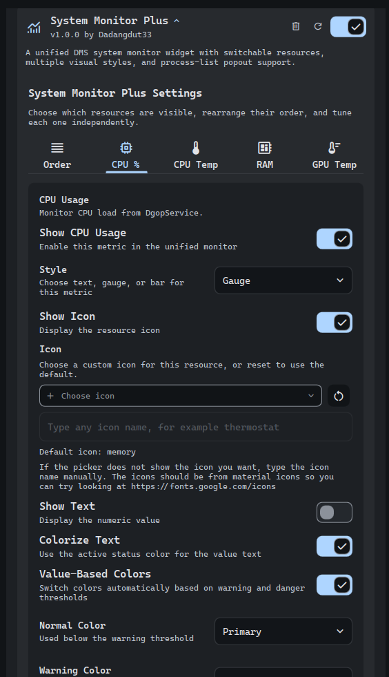

# System Monitor Plus

Unified system monitor plugin for DankMaterialShell.

This plugin uses the same service from the stock DMS plugin (`DgopService`) to read the system data, but it adds a lot of customization options and different looks to choose from.

The functionality should be the same as the stock DMS plugin, but with more options to customize the look and feel of the widget..

## Features

- Switch between `CPU usage`, `CPU temperature`, `RAM usage`, and `GPU temperature`
- Three looks:
  - `Default`: icon + text
  - `Gauge`: icon with a circular speedometer-style ring
  - `Bar`: icon + text with a progress bar
- Fixed color mode or automatic `normal / warning / danger` colors
- Opens the stock DMS process-list popout when clicked
- Reads system data from `DgopService`

## Preview

